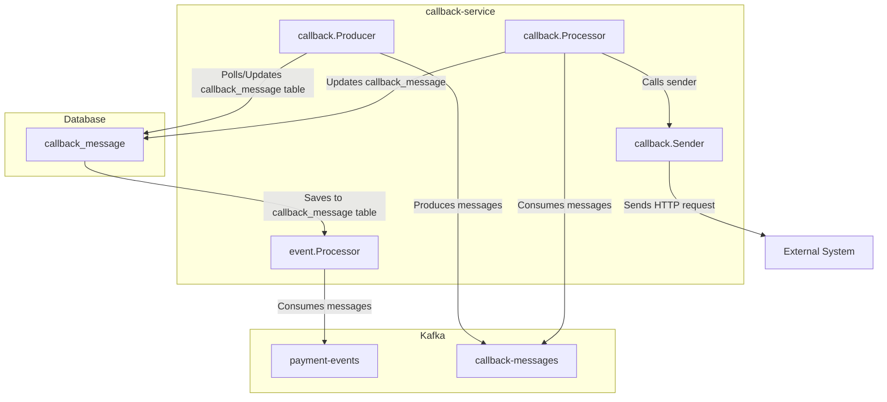

# Callback Service

A Go-based service leveraging Kafka and PostgreSQL to provide a reliable solution for asynchronous callback delivery,
decoupling the callback process and ensuring delivery even with temporary failures.

## Tech Stack

The project uses the following technologies:

- **[Go](https://golang.org)**: The main programming language used for the project.
- **[UUID](https://github.com/google/uuid)**: For generating unique identifiers.
- **[Godotenv](https://github.com/joho/godotenv)**: For loading environment variables from `.env` files.
- **[LibPQ](https://github.com/lib/pq)**: PostgreSQL driver for Go.
- **[PGX](https://github.com/jackc/pgx)**: PostgreSQL driver and toolkit.
- **[Goose](https://github.com/pressly/goose)**: Database migration tool.
- **[Kafka-Go](https://github.com/segmentio/kafka-go)**: Kafka client library for Go.
- **[Testify](https://github.com/stretchr/testify)**: Testing toolkit for Go.
- **[Gock](https://github.com/h2non/gock)**: For HTTP mocking in tests.
- **[Testcontainers-Go](https://github.com/testcontainers/testcontainers-go)**: Library for integration testing with
  Docker containers.
- **[Testcontainers-Go Postgres Module](https://github.com/testcontainers/testcontainers-go/tree/main/modules/postgres)**: PostgreSQL module for Testcontainers-Go.

## Callback delivery flow

1. Consuming messages from the `payment-events` topic and saving to DB:
    1. Reading Messages: Continuously read messages from the Kafka topic.
    2. Unmarshalling Messages: Convert the message payload from JSON to a `PaymentEvent` struct.
    3. Processing Events: Use the `Processor` to process the `PaymentEvent`.
    4. Creating Callback Message: Create a `Callback` payload and marshal it into JSON.
    5. Database Insertion: Insert the new callback message into the `callback_message` DB table. Callback Message Table:
       The `callback_message` table schema includes fields like `id`, `payment_id`, `payload`, `url`, `created_at`,
       `updated_at`, `scheduled_at`, `delivered_at`, `delivery_attempts`, `publish_attempts`, and `error`.

2. Fetch unprocessed callbacks:
    1. Retrieve unprocessed callback messages from the database based on the `scheduled_at` field.
    2. For each callback, create a Kafka message with the callback details.
    3. Send the prepared Kafka messages to the `callback-messages` Kafka topic.
    4. Update callback message based on Kafka write result:
        * If writing to Kafka fails:
            * Increment the PublishAttempts counter.
            * If PublishAttempts reaches the maximum allowed attempts, clear the `scheduled_at` field and set the Error
              field with the error message.
            * If PublishAttempts is less than the maximum allowed attempts, schedule the callback for a retry by setting
              the `scheduled_at` field to a future time.
        * If writing to Kafka succeeds:
            * Clear the `scheduled_at` and `error` fields.
    5. Commit the database transaction to save the changes. If committing fails, roll back the transaction.

3. Processing messages:
    1. Continuously read messages from the `callback-messages` Kafka topic.
    2. Acquire semaphore: Acquire a semaphore to limit the number of concurrent processing goroutines.
    3. Send callback message: Send the callback message using the `Sender`.
    4. Start a transaction: Begin a new database transaction.
    5. Fetch callback for update: Retrieve the callback message for update by its ID.
    6. Increment delivery attempts: Increment the `DeliveryAttempts` counter.
    7. Handle callback sending result:
        * If sending the callback fails:
            * Log the error.
            * If `DeliveryAttempts` reaches the maximum allowed attempts, clear the `ScheduledAt` field and set the
              `Error` field with the error message.
            * If `DeliveryAttempts` is less than the maximum allowed attempts, schedule the callback for a retry by
              setting the `ScheduledAt` field to a future time and reset the `PublishAttempts` counter.
        * If sending the callback succeeds:
            * Log the success.
            * Set the `DeliveredAt` field to the current time, clear the `ScheduledAt` and `Error` fields.
    8. Update callback message: Update the callback message in the database.
    9. Commit the transaction: Commit the database transaction to save the changes. If committing fails, roll back the
       transaction.
    10. Release semaphore: Release the semaphore after processing is complete.

## Components



## Configuration

The `.env` file contains environment variables that configure the callback service. Here is an explanation of each
variable:

- `DB_USER`: The username for the database connection.
- `DB_PASSWORD`: The password for the database connection.
- `DB_NAME`: The name of the database to connect to.
- `DB_HOST`: The hostname or IP address of the database server.
- `DB_PORT`: The port number on which the database server is listening.
- `SSL_MODE`: The SSL mode for the database connection (e.g., disable, require).

- `KAFKA_WRITER_BATCH_SIZE`: The batch size for writing messages to Kafka.
- `KAFKA_WRITER_BATCH_TIMEOUT`: The timeout for batching messages before sending them to Kafka.
- `KAFKA_URL`: The URL of the Kafka broker.

- `PAYMENT_EVENTS_TOPIC`: The Kafka topic for payment events.
- `CALLBACK_MESSAGES_TOPIC`: The Kafka topic for callback messages.
- `CALLBACK_SERVICE_GROUP_ID`: The consumer group ID for the callback service.

- `CALLBACK_PROCESSING_PARALLELISM`: The number of concurrent callback processing goroutines.
- `CALLBACK_POLLING_INTERVAL_MS`: The interval in milliseconds for polling unprocessed callbacks.
- `CALLBACK_TIMEOUT_MS`: The timeout in milliseconds for sending a callback.
- `CALLBACK_FETCH_SIZE`: The number of unprocessed callbacks to fetch in each polling interval.
- `CALLBACK_RETRY_DELAY_MS`: The delay in milliseconds before retrying a failed callback.
- `CALLBACK_RETRY_PUBLISH_DELAY_MS`: The delay in milliseconds before retrying a failed Kafka publish.
- `MAX_DELIVERY_ATTEMPTS`: The maximum number of attempts to deliver a callback.
- `MAX_PUBLISH_ATTEMPTS`: The maximum number of attempts to publish a callback message to Kafka.

- `SERVER_PORT`: The port number on which the callback service server listens.

## Data structures

### Payment event message example

```json

{
  "id": "99d2aa54-7dc6-487e-a3eb-77a5c6135446",
  "event": "created",
  "payload": {
    "id": "e3814f7f-b6ba-4cf8-923b-f7064c8b614c",
    "amount": 100,
    "currency": "USD",
    "status": "created",
    "createdAt": "2021-09-29T12:00:00Z",
    "updatedAt": "2021-09-29T12:00:00Z",
    "callbackUrl": "http://localhost:8085/callback"
  }
}
```

### `callback_message` table schema

The `callback_message` table schema is designed to store information about callback messages that need to be processed
and sent. Here is an explanation of each field:

- `id`: A unique identifier for each callback message (UUID).
- `payment_id`: The identifier of the related payment (UUID).
- `payload`: The JSON payload of the callback message (JSONB).
- `url`: The URL to which the callback message should be sent (VARCHAR(2048)).
- `created_at`: The timestamp when the callback message was created (TIMESTAMP).
- `updated_at`: The timestamp when the callback message was last updated (TIMESTAMP).
- `scheduled_at`: The timestamp when the callback message is scheduled to be sent (TIMESTAMP, nullable).
- `delivered_at`: The timestamp when the callback message was successfully delivered (TIMESTAMP, nullable).
- `delivery_attempts`: The number of attempts made to deliver the callback message (INT, default 0).
- `publish_attempts`: The number of attempts made to publish the callback message to the Kafka topic (INT, default 0).
- `error`: Any error message encountered during the processing or delivery of the callback message (TEXT, nullable).

### Callback body example:

```json
{
  "id": "99d2aa54-7dc6-487e-a3eb-77a5c6135446",
  "paymentId": "3814f7f-b6ba-4cf8-923b-f7064c8b614c",
  "status": "succeeded"
}
```

### Generate test data

```sql
INSERT INTO callback_message (id, payment_id, payload, url, created_at, updated_at, scheduled_at, delivered_at,
                              delivery_attempts, publish_attempts, error)
SELECT gen_random_uuid()                                                AS id,
       gen_random_uuid()                                                AS payment_id,
       jsonb_build_object('id', gen_random_uuid(), 'status', 'created') AS payload,
       'http://localhost:8085/success-delayed'                          AS url,
       NOW()                                                            AS created_at,
       NOW()                                                            AS updated_at,
       NOW()                                                            AS scheduled_at,
       NULL                                                             AS delivered_at,
       0                                                                AS delivery_attempts,
       0                                                                AS publish_attempts,
       NULL                                                             AS error
FROM generate_series(1, 100000);
```